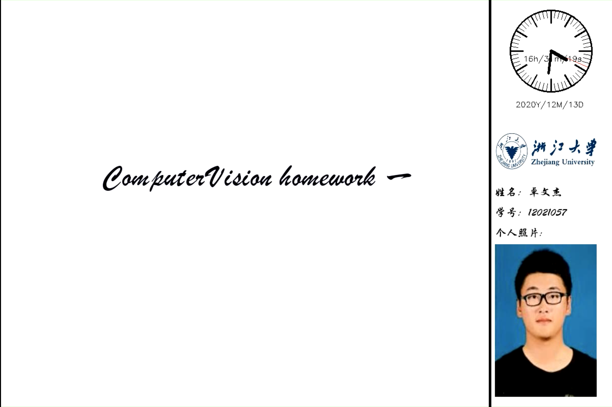
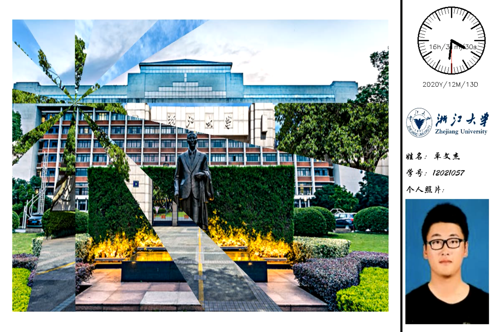
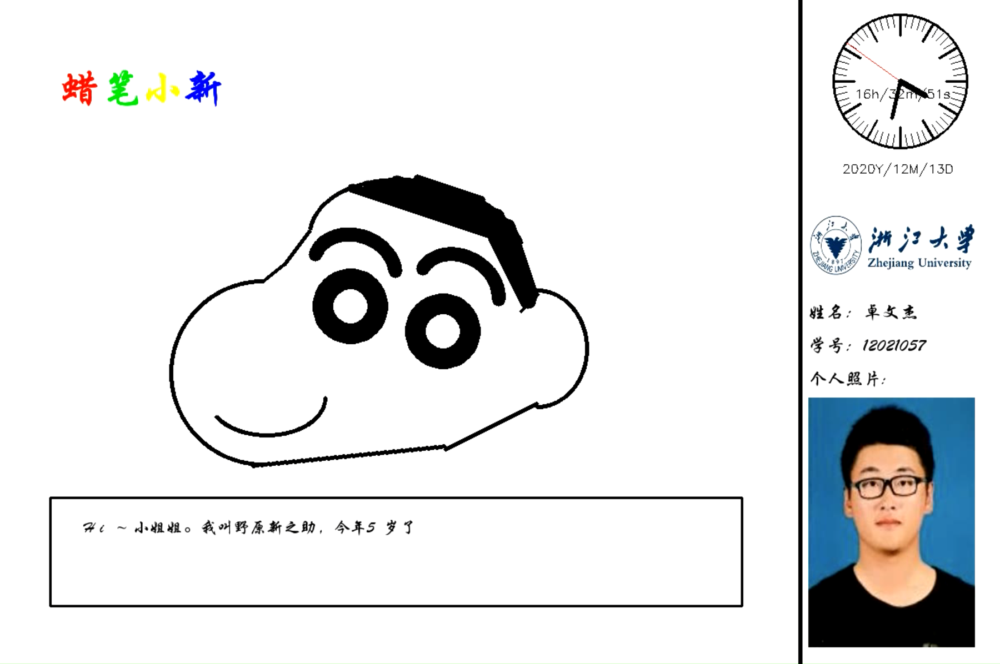
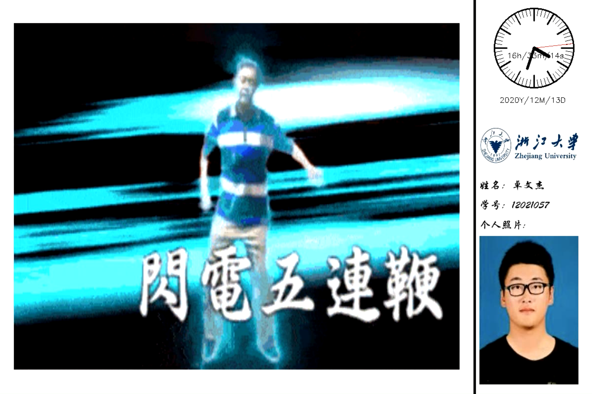

# CV课程第一次作业

### 安装所依赖的库
```
pip install -r ./requirements.txt
```

### 运行说明
```
python main.py
```

### 文件说明

- ``/font`` 存放程序所需字体
- ``/img`` 存放主界面所需的图片
- ``/zju`` 存放浙江大学元素照片
- ``/utils`` 存放程序所依赖的文件
    - ``/utils/clock.py`` 主界面的时钟程序
    - ``/utils/draw.py`` 儿童画程序（写死）
    - ``/utils/special.py`` 实现照片的镜头切换效果
    - ``/utils/util.py`` 包含在图片中加中文字幕和gif分割两个功能
- ``/main.py``  主程序
- ``README.md`` 程序说明
- ``requirements.txt`` 程序所依赖的第三方库
- ``resultVideo.avi`` 程序结果视频保存
- ``results`` 存放结果图片

### 程序界面
1. 主界面

2. 浙大元素及切换效果

3. 儿童画结果

4. 其他内容

5. 谢幕

