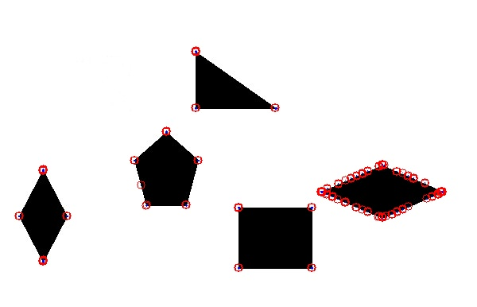
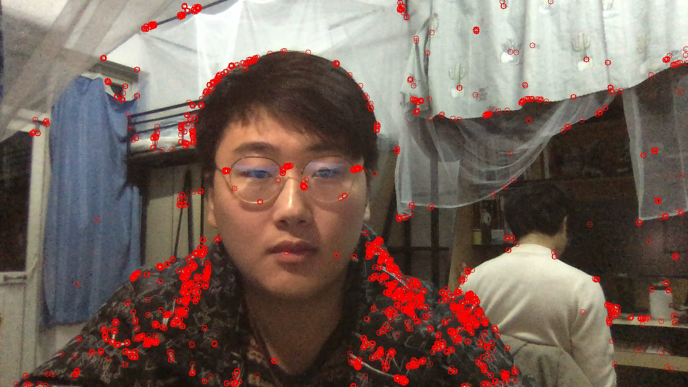
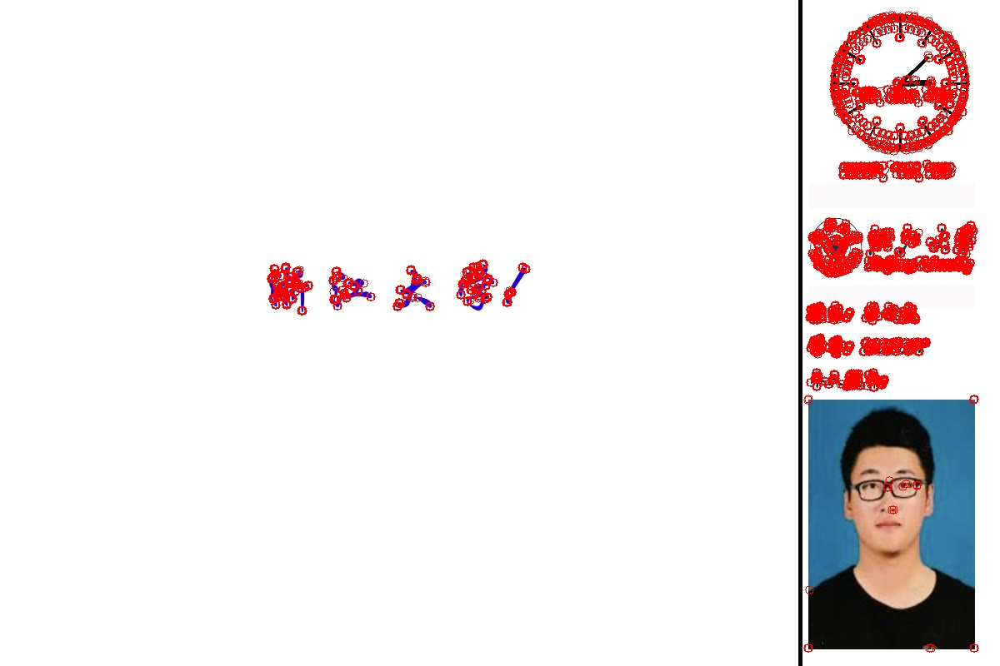
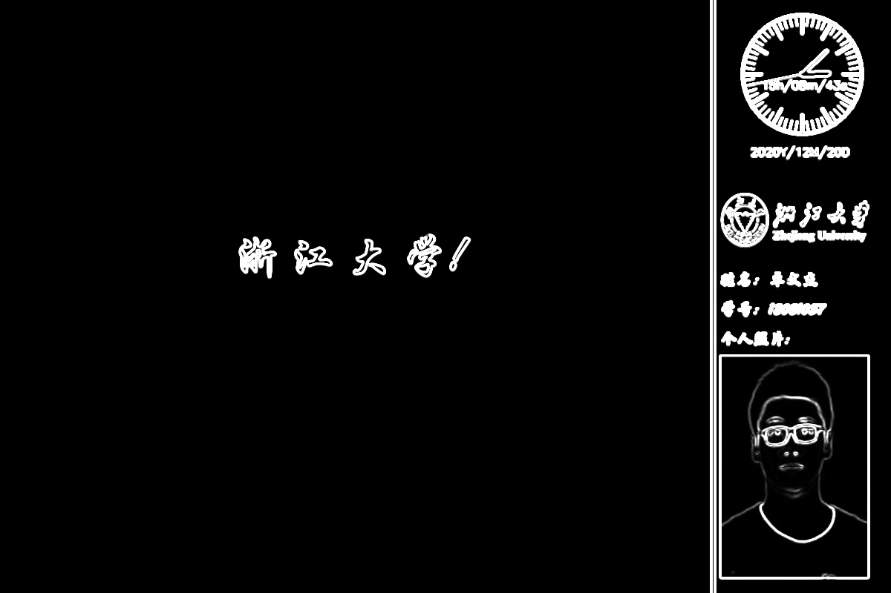
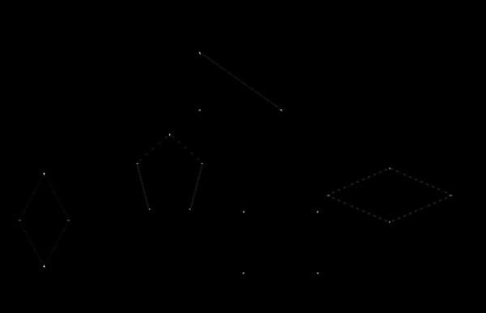
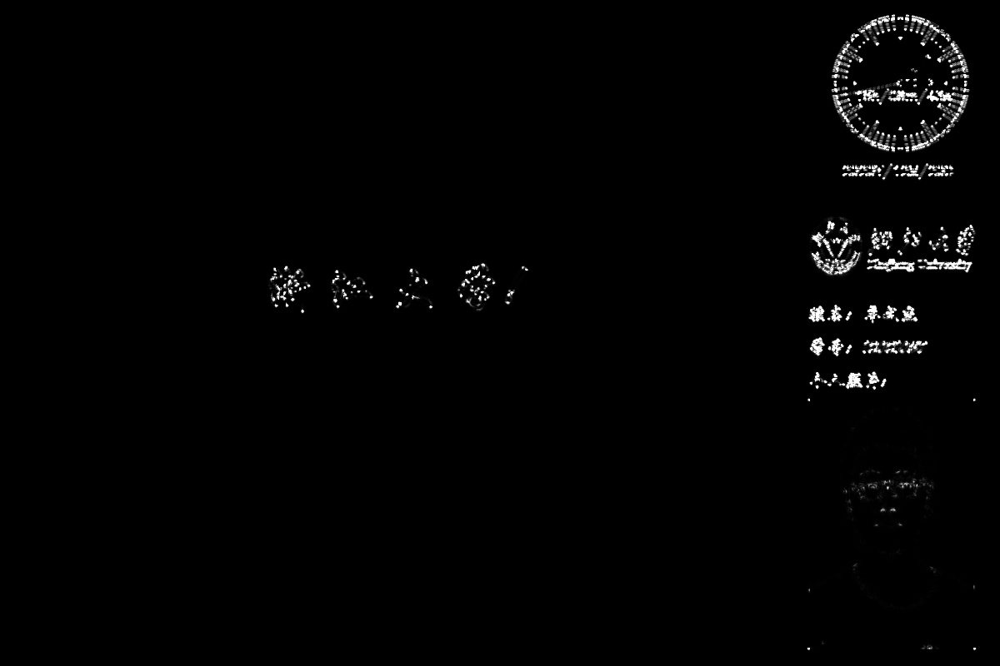
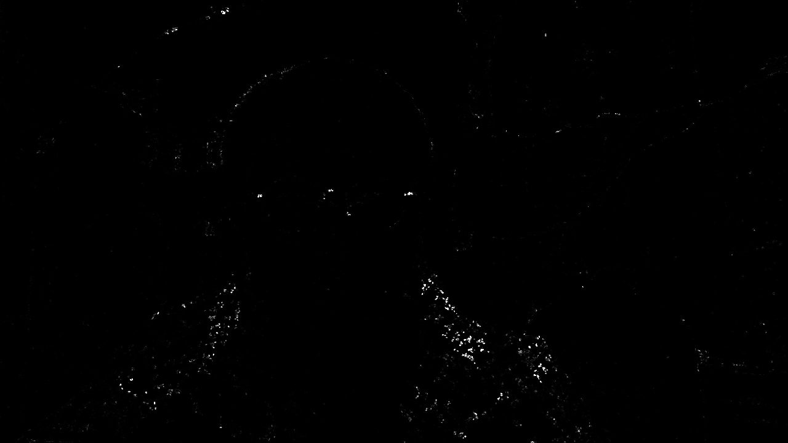

# CV课程第二次作业

### 安装所依赖的库
```
pip install -r ./requirements.txt
```

### 运行说明
```
python main.py #调用电脑摄像头实时处理
python main.py -i inputfilename #输入想要回放视频的文件名
```
- -i  INPUTFILE， --inputfile 想要回放的视频文件名，默认为空，当没有文件名输入时，程序将调用摄像头来进行实时的视频处理。

### 文件说明

- ``main.py``  主程序
- ``Harris_Corner.py`` 存放Harris_Corner类的文件
- ``README.md`` 系统说明
- ``requirements.txt`` 程序所依赖的第三方库
- ``resultVideo.avi`` 程序需要处理的视频文件
- ``results`` 存放结果图片
    - ``corner.jpg`` 存放角点检测结果的叠加图
    - ``max_eig.jpg`` 存放最大特征值图
    - ``min_eig.jpg`` 存放最小特征值图
    - ``R.jpg`` 存放R图

### 程序界面
1. 角点检测结果叠加图



2. 最大特征值图



3. 最小特征值图



4. R图


